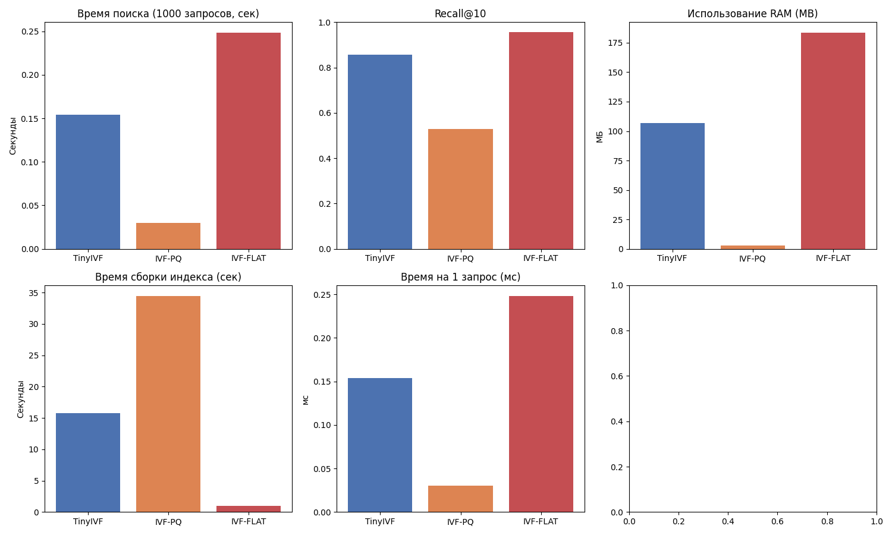

# TinyIVF

TinyIVF - это векторный индекс, в основе которого лежит алгоритм IVF. Его уникальная особенность в применении адаптивного SVD сжатия к каждому кластеру во время обучения, таким образом храня вектора в самом оптимальном для них состоянии. Срез матрицы Vt расчитывается исходя из энтропии сингулярных чисел.
## Результаты

Тестирование проведено на датасете Fashion-MNIST (размерность 784, 60 000 векторов в обучающей выборке, 1000 в тестовой).
Параметры индексов: 100 кластеров, nprobe=3. Используется метрика L2. Для IVF-PQ параметры: M=16, nbits=8.

## Графики



## Установка

```bash
pip install git+https://github.com/Sasha201089/tiny_ivf.git
```

## Использование

```python
from tinyivf import TinyIVF

index = RAMIndex(dim=784, n_clusters=100, nprobe=3)
index.train(your_vectors)
index.add_items(your_vectors)

results = index.query(vector, k=10)
